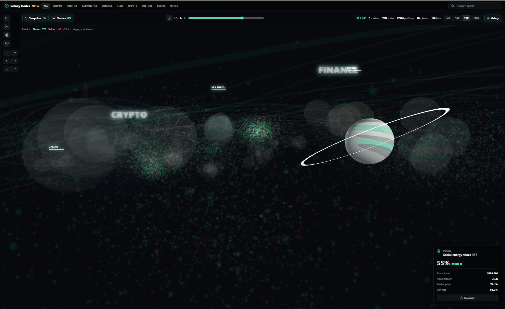

# Galaxy Nodes

A reusable React + Three.js library for navigating dense graph data as a galaxy. It renders GPU point clouds, planet-like graph nodes, selectable relationships, sparse cluster labels, camera navigation, search focus, category filters, and hover/click inspection.



## Install

```bash
npm install galaxy-nodes three react react-dom
```

## Use

```tsx
import {
  GalaxyGraphVisualizer,
  generateGalaxyDataset,
  type GraphDataset,
} from 'galaxy-nodes';
import 'galaxy-nodes/styles.css';

const dataset: GraphDataset = generateGalaxyDataset(75_000);

export function GraphView() {
  return (
    <GalaxyGraphVisualizer
      dataset={dataset}
      options={{
        showNavigationControls: true,
        showStats: true,
      }}
      onSelectNode={(node) => console.log(node)}
      onSelectEdge={(edge) => console.log(edge)}
    />
  );
}
```

Lower-level scene-only embedding is available through `GalaxyScene` when you want to provide your own HUD, panels, and data controls.

## Develop

```bash
npm install
npm run dev
```

The dev server runs `examples/basic`, which imports the library through the package export path. Build the package and example separately:

```bash
npm run build
npm run build:example
```

## Memgraph Demo

This repo includes a Dockerized Memgraph demo in `demo/memgraph`.

```bash
cd demo/memgraph
docker compose up --build
```

That starts Memgraph Platform, seeds a graph dataset into Memgraph, and exposes a graph API on `http://localhost:8787/graph`. Run the example with `VITE_GRAPH_API_URL=http://127.0.0.1:8787`, then use the database button in the left toolbar to load nodes and relationships from Memgraph.

## Dataset Import

The library accepts a `GraphDataset` with this shape:

```ts
interface GraphDataset {
  nodes: GraphNode[];
  edges: GraphEdge[];
  clusters: GraphCluster[];
  generatedAt: string;
}

interface GraphNode {
  id: string;
  label: string;
  category: 'Crypto' | 'Politics' | 'Geopolitics' | 'Finance' | 'Tech' | 'Sports' | 'Culture' | 'Social' | 'Other';
  clusterId: string;
  position: { x: number; y: number; z: number };
  size: number;
  score: number;
  sentiment: 'yes' | 'no' | 'mixed';
  metrics: {
    volume: number;
    activeTraders: number;
    marketPrice: number;
    winRate: number;
  };
  isMajor: boolean;
}

interface GraphEdge {
  id?: string;
  source: string;
  target: string;
  weight: number;
  kind: 'filament' | 'trade' | 'signal';
}

interface GraphCluster {
  id: string;
  label: string;
  category: GraphNode['category'];
  center: { x: number; y: number; z: number };
  radius: number;
  nodeCount: number;
  score: number;
}
```

Edges whose `source` and `target` match cluster ids render as large-scale galaxy filaments. 

Edges whose endpoints match node ids render as selectable graph relationships. Nodes marked `isMajor` become interactive planet nodes. Use the left rail buttons or keyboard movement (`WASD`/arrow keys, `Q`/`E`) to translate through the graph volume instead of only orbiting around it.

Keyboard navigation is scoped to the scene, click the canvas once to focus it so the controls don't capture keys from the rest of your page.
